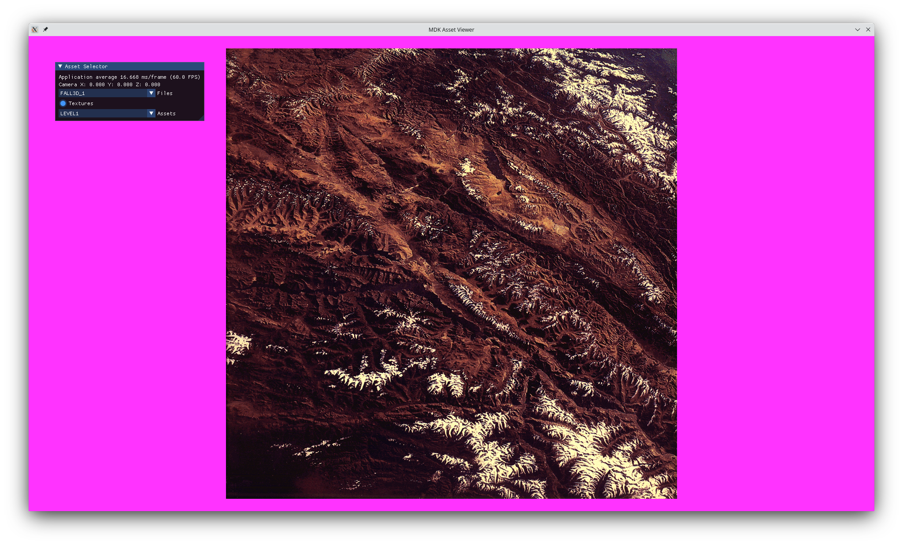

# mdk-asset-viewer
## SDL2/OpenGL-based application for viewing MDK's assets

### Overview

This project is an attempt to read MDK's binary asset files and present them using SDL2 and modern OpenGL.

### Usage

Place the compiled executable in MDK's root directory (alongside MDK's executable)

### Features

- SDL2 and modern OpenGL renderer
- Dear ImGUI integration

### Current State

